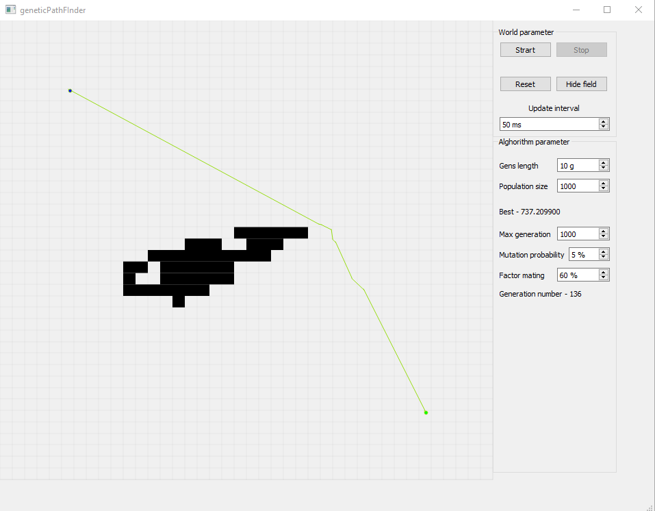

# Программа визуализатор работы генетического алгоритма

 Программа визуализатор работы генетического алгоритма для нахождения кратчайшего пути. 
 Программа написана на с++ с использование библиотеки QT. Написано давно (в районе 2015 года) для знакомого студента, из-за этого весь текст программы щедро осыпан комментариями. Работу на новых версиях QT не тестировал. Скомпилированная программа под windows прилагается.
 
 # Genetic Algorithm Visualizer Program
 
The program visualizer of the genetic algorithm for finding the shortest path.
The program is written in C ++ using the QT library. It was written a long time ago (about 2015) for a student I knew, because of this, the entire text of the program is generously showered with comments in Russian. I did not test work on new QT versions. A compiled program for windows is included.
 
 
